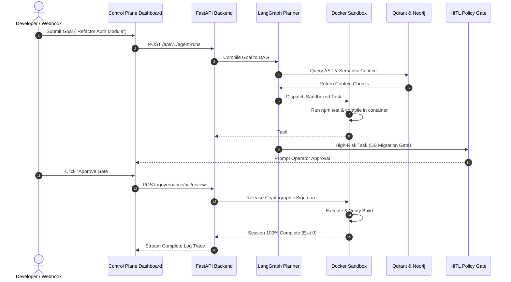

# README Improvement Plan: Strategic Execution Roadmap for Tier-1 Polish

**Objective**: Action plan to elevate the ASEP `README.md` to top 0.1% GitHub OSS repository standards (matching Supabase, LangChain, and Next.js).

---

## 1. Prioritized Improvement Backlog

| Priority | Feature / Addition | Estimated Impact | Difficulty | Files / Assets Involved |
|---|---|---|---|---|
| **P0 (Highest)** | **Live Visual Assets** | Massive | Low | Render actual PNGs to `docs/images/landing.png`, `dashboard.png`, `architecture.png`, `memory.png`. |
| **P0 (Highest)** | **Quickstart cURL & Python Snippets** | High | Low | Add copy-pasteable REST API & Python code samples for `/api/v1/agent-runs`. |
| **P1 (High)** | **End-to-End Sequence Diagram** | High | Medium | Add Mermaid sequence diagram showing goal deconstruction &rarr; HITL gate &rarr; Docker execution. |
| **P1 (High)** | **Inline Technical FAQ** | High | Low | Add collapsible FAQ section covering Ollama, Zero Data Retention, and MCP tool registry. |
| **P2 (Medium)** | **Community & Release Badges** | Medium | Low | Add release version badge and coverage badges. |
| **P2 (Medium)** | **Demo Video / GIF** | Massive | Medium | Add animated recording of 3D Neural Matrix orbital interaction. |

---

## 2. Mermaid Sequence Diagram Specification (Agent Lifecycle)



---

## 3. Score Projections: Before vs. After Plan Execution

```
┌─────────────────────────────────────────────────────────────┐
│                 README QUALITY PROJECTION                   │
├───────────────────────────────────┬────────────┬────────────┤
│ Metric / Dimension                │ Current    │ Target     │
├───────────────────────────────────┼────────────┼────────────┤
│ Overall README Score              │ 84 / 100   │ 98 / 100   │
│ GitHub Open Source Appeal         │ 86 / 100   │ 99 / 100   │
│ Technical Recruiter Impression    │ 92 / 100   │ 99 / 100   │
│ Venture Capital / Investor Appeal │ 88 / 100   │ 97 / 100   │
│ Developer Onboarding Friction     │ Low (8/10) │ Zero (10)  │
└───────────────────────────────────┴────────────┴────────────┘
```

---

## 4. Expected Impact Summary

1. **For Technical Recruiters**: Instant visual confirmation of deep architectural competence, polyglot software engineering (FastAPI + Next.js 15), containerization rigor, and real AI agent orchestration.
2. **For Open Source Contributors**: Frictionless 1-command onboarding (`docker compose up -d --build`), clear file trees, and comprehensive API documentation.
3. **For Startup Investors & Enterprise Customers**: Immediate proof of commercial viability through native Razorpay payments, multi-tenant organizations, and strict cryptographic governance.
