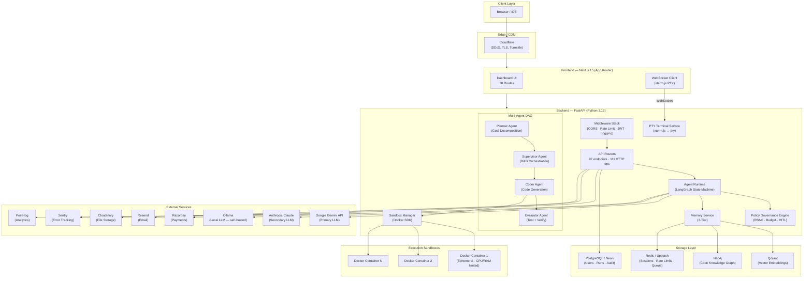
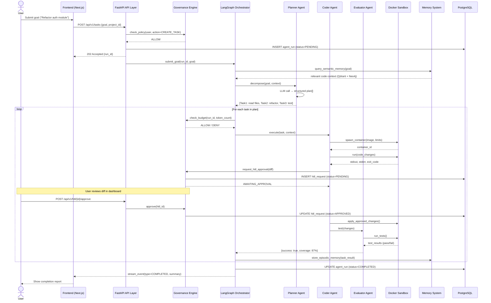
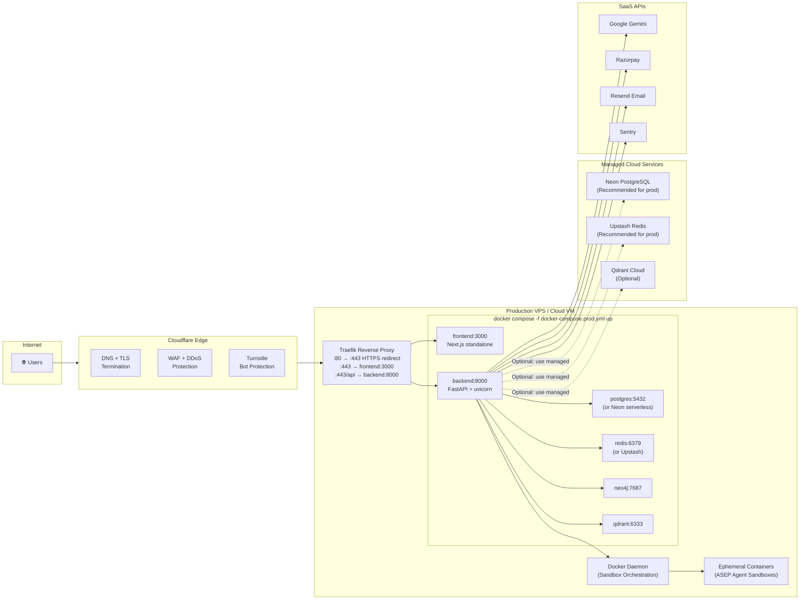
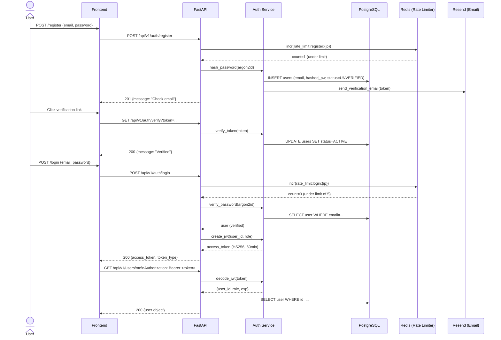
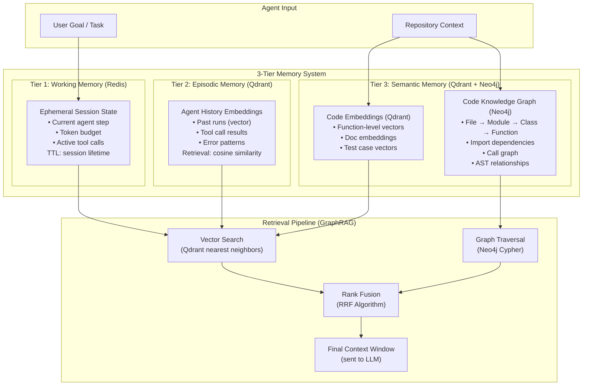

# ASEP — Architecture Diagrams

**Version:** 0.1.3  
**Date:** 2026-08-23

---

## 1. SYSTEM ARCHITECTURE OVERVIEW

---

## 2. DATA FLOW — AGENT RUN (End-to-End)

---

## 3. DEPLOYMENT ARCHITECTURE (Production)

---

## 4. AUTHENTICATION FLOW

---

## 5. MEMORY SYSTEM ARCHITECTURE (3-Tier)

---

## 6. NETWORK & PORT MAP (Local Development)

| Service | Internal Port | External Port | Protocol |
|---|---|---|---|
| Next.js Frontend | 3000 | 3000 | HTTP |
| FastAPI Backend | 8000 | 8000 | HTTP + WebSocket |
| PostgreSQL | 5432 | 5432 | TCP |
| Redis | 6379 | 6379 | TCP |
| Neo4j Browser | 7474 | 7474 | HTTP |
| Neo4j Bolt | 7687 | 7687 | Bolt/TCP |
| Qdrant REST | 6333 | 6333 | HTTP |
| Qdrant gRPC | 6334 | 6334 | gRPC |
| Ollama | 11434 | 11434 | HTTP |

---

## 7. TECHNOLOGY STACK SUMMARY

| Layer | Technology | Version | Purpose |
|---|---|---|---|
| **Frontend Framework** | Next.js (App Router) | 15.1.0 | SSR, routing, React 19 |
| **UI Components** | Radix UI + Tailwind CSS + shadcn/ui | Latest | Accessible component system |
| **Terminal** | xterm.js + WebSocket | 6.x | Browser PTY terminal |
| **3D Visualization** | WebGL / Three.js (via cobe) | 2.x | Neural matrix visualization |
| **State Management** | TanStack Query | 5.x | Server state + caching |
| **Backend Framework** | FastAPI | 0.115.x | Async REST API + WebSocket |
| **Agent Orchestration** | LangGraph | 0.2.x | Multi-agent state machines |
| **LLM Providers** | Gemini, Claude, Ollama | Latest | Code generation and reasoning |
| **Primary Database** | PostgreSQL (async via asyncpg) | 14+ | Persistent application data |
| **Cache / Queue** | Redis | 7.x | Rate limits, sessions, events |
| **Vector Database** | Qdrant | 1.x | Semantic memory embeddings |
| **Graph Database** | Neo4j | 5.x | Code knowledge graph |
| **ORM** | SQLAlchemy 2.0 (async) | 2.x | Database abstraction |
| **Migrations** | Alembic | 1.14.x | Schema version control |
| **Authentication** | JWT (HS256) + Argon2id | — | Auth + password hashing |
| **Payments** | Razorpay | 2.x | Subscription billing |
| **Email** | Resend | 2.x | Transactional email |
| **Error Tracking** | Sentry | 2.x | Runtime error monitoring |
| **Analytics** | PostHog | 1.x | Product analytics |
| **Bot Protection** | Cloudflare Turnstile | — | CAPTCHA on auth endpoints |
| **Sandbox Execution** | Docker SDK (Python) | 7.x | Ephemeral code execution |
| **Testing (Backend)** | pytest + pytest-asyncio | 9.x | 199 tests, 63% coverage |
| **Testing (Frontend)** | Vitest + Playwright | 4.x / 1.x | Unit + E2E tests |
