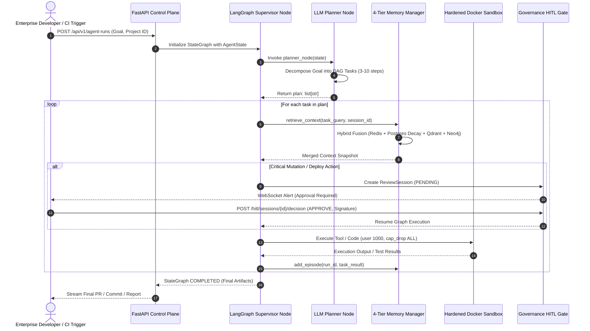
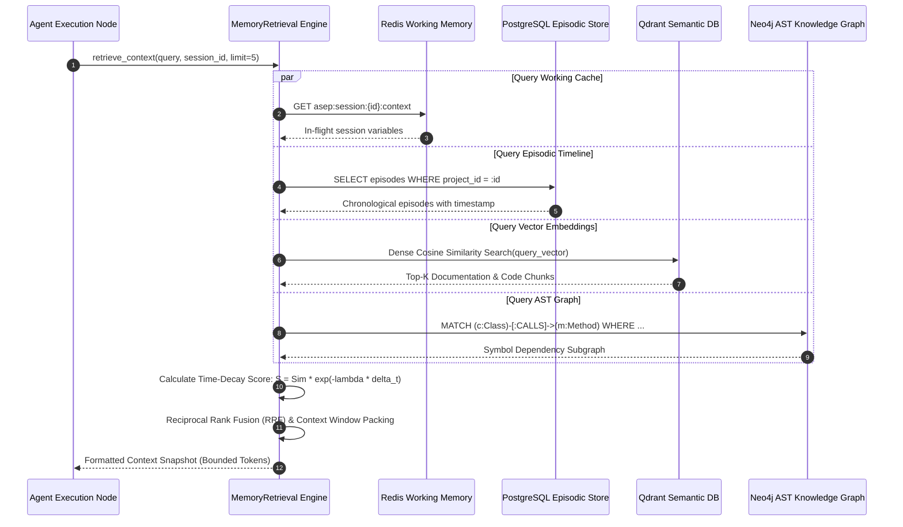
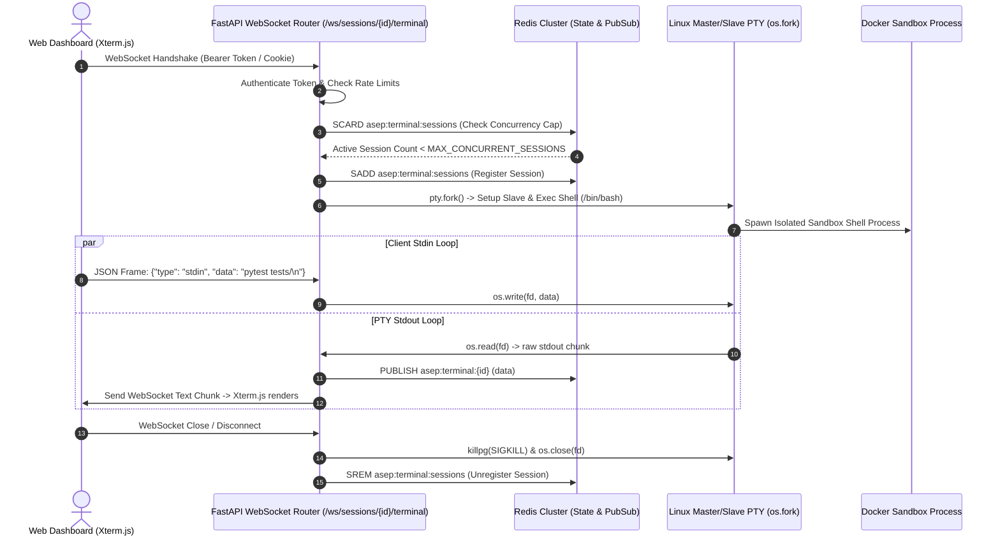

# ASEP — System Sequence & Data Flow Specification
**Document ID:** ASEP-ARCH-DOC-003  
**Version:** 1.0 (Institutional Due Diligence)  
**Author:** Principal Software Architect (Rounak Kumar Sah)  
**Date:** August 24, 2026  

---

## 1. Goal Ingestion, Planning & Execution Sequence

---

## 2. 4-Tier Memory Retrieval & Decay Fusion Flow

---

## 3. Interactive WebSocket PTY Terminal Streaming

---
*Verified architectural specification.*
