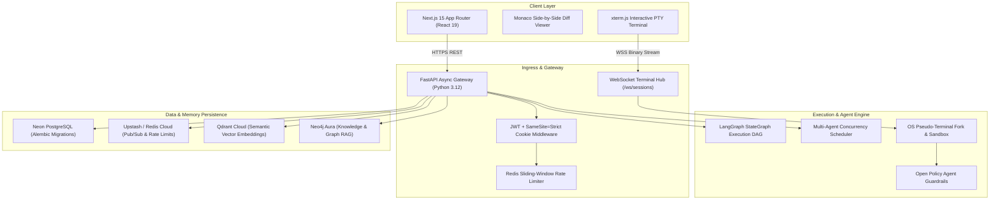

# ASEP — Technical Architecture & System Specification
======================================================
Autonomous Software Engineering Platform (v1.0.0)

## 1. System Topology Overview

## 2. Core Architectural Pillars

### Pillar 1: Asynchronous Execution Engine
* **Technology**: Python 3.12, FastAPI, AsyncIO, LangGraph.
* **Mechanism**: Workflows execute as immutable StateGraph DAGs where nodes represent task steps (Plan -> Execute -> Test -> Reflect -> Consolidate). Checkpoints are continuously saved to PostgreSQL.

### Pillar 2: Bidirectional PTY Terminal Streamer
* **Technology**: Python `pty` module, WebSockets, `xterm.js`, Redis Pub/Sub.
* **Mechanism**: Spawns true OS pseudo-terminals with low-level `os.write` avoiding shell injection hazards. Output streams in real-time to the browser client with horizontal replica synchronization over Redis channels.

### Pillar 3: Multi-Layer Memory Architecture
* **Working Memory**: Redis ephemeral fast key-value store.
* **Episodic Memory**: PostgreSQL immutable execution logs and thread checkpoints.
* **Semantic Memory**: Qdrant vector database (cosine similarity search over codebase chunks).
* **Graph / Procedural Memory**: Neo4j property graph mapping dependency relationships.

### Pillar 4: Security & Governance
* **Human-in-the-Loop (HITL)**: Mandatory approval gates intercept high-risk operations (e.g. database schema alterations, production deploys).
* **Monaco Diff Viewer**: Side-by-side visual diff comparisons for human operator verification.
* **TOTP MFA**: RFC 6238 compliant authenticator app verification with encrypted backup recovery codes.
* **Payment Processing**: Razorpay HMAC-SHA256 signature verification on orders and webhooks.
