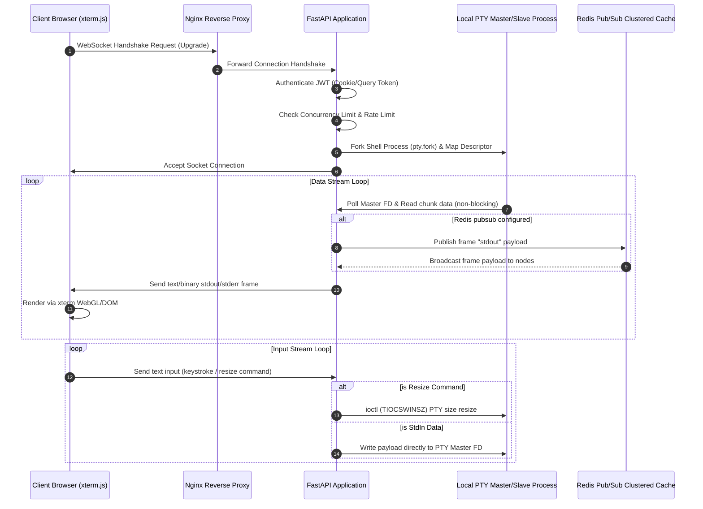

# Production Technical Specification: WebSocket Terminal Streaming
=====================================================================

This document describes the architectural layout, communication protocols, configuration schemas, and deployment topologies required to expose interactive, low-latency, and safe terminal streams within the OpenSEP environment.

---

## 1. Architectural Overview



---

## 2. Required Dependencies

### Backend (Python Packages)
Ensure the following packages are compiled inside your Python environment (`backend/pyproject.toml`):
```toml
[tool.poetry.dependencies]
python = "^3.12"
fastapi = "^0.110.0"
uvicorn = "^0.28.0"
redis = "^5.0.1"
```

### Frontend (npm Packages)
Run this installer inside the `frontend/` directory to fetch the terminal emulator libraries:
```bash
npm install @xterm/xterm @xterm/addon-attach @xterm/addon-fit @xterm/addon-webgl
```

---

## 3. Environment Variables

| Variable | Scope | Default Value | Description |
| :--- | :--- | :--- | :--- |
| `REDIS_URL` | Backend | `None` | Endpoint connection coordinates to enable Redis Pub/Sub cluster terminal sync. |
| `TERMINAL_SHELL` | Backend | `/bin/bash` | Target executable binary path spawned as the shell process inside PTY master. |
| `JWT_SECRET_KEY` | Backend | `None` | Cryptographic signature validation key used to decode socket credentials. |
| `NEXT_PUBLIC_WS_URL` | Frontend | `ws://localhost:8000/api/v1` | Root WebSocket path of the backend router. |

---

## 4. Nginx Reverse-Proxy Configuration

```nginx
# WebSocket Upstream Routing Definition
upstream backend_ws_upstream {
    server 127.0.0.1:8000;
    keepalive 32;
}

server {
    listen 80;
    server_name app.asep.local;

    location /api/v1/ws/ {
        proxy_pass http://backend_ws_upstream;
        
        # Configure WebSocket protocol upgrades
        proxy_http_version 1.1;
        proxy_set_header Upgrade $http_upgrade;
        proxy_set_header Connection "upgrade";
        
        # Pass core host metadata parameters
        proxy_set_header Host $host;
        proxy_set_header X-Real-IP $remote_addr;
        proxy_set_header X-Forwarded-For $proxy_add_x_forwarded_for;
        proxy_set_header X-Forwarded-Proto $scheme;
        
        # Prevent premature socket timeouts on idle sessions
        proxy_read_timeout 3600s;
        proxy_send_timeout 3600s;
        
        # Disable response buffering for immediate terminal streaming
        proxy_buffering off;
        
        # Keepalive limits
        proxy_ignore_client_abort on;
    }
}
```

---

## 5. Message Protocol Schema

All structured commands are transmitted over the connection using JSON string frames. Raw input is piped as standard stdin strings.

### A. Terminal Resize Geometry (Client -> Server)
```json
{
  "type": "resize",
  "cols": 120,
  "rows": 30
}
```

### B. Standard Input keystrokes (Client -> Server)
```json
{
  "type": "stdin",
  "data": "ls -la\r"
}
```

### C. Software Flow Control: Pause Stream (Client -> Server)
```json
{
  "type": "pause"
}
```

### D. Software Flow Control: Resume Stream (Client -> Server)
```json
{
  "type": "resume"
}
```

---

## 6. Security Considerations

1. **JWT Verification**: Connections require the user's `access_token` JWT inside cookies or as a `token` URL query parameter. Socket connections are rejected if signature verification fails or if the user status is not `active`.
2. **Concurrent Connection Limits**: The terminal router restricts resource exhaustion by limiting the maximum number of concurrent active local PTY connections per node (defaulting to 25).
3. **Sliding Window Rate Limiting**: The system limits socket initiation attempts per remote IP (maximum 10 connections per minute) to prevent Denial of Service (DoS) attacks.
4. **Shell Isolation**: Shell processes execute inside standard sandboxed workspaces. System administrators must configure `TERMINAL_SHELL` to an isolated binary workspace execution framework to prevent host system exposure.

---

## 7. Backpressure & Flow Control Strategy

Terminal emulator streams emit data at high frequencies. Browser renderers can freeze if overloaded. To mitigate this:
1. **Flow Monitoring**: The client measures its rendering queue capacity (`terminal.buffer.active.length`).
2. **XOFF Trigger**: If the queue exceeds 1,000 frames, the client sends a `{"type": "pause"}` command. The backend PTY reader pauses its Master FD read cycles.
3. **XON Trigger**: Once the client queue falls below 200 frames, the client sends `{"type": "resume"}` to restart raw data piping.

---

## 8. Scaling Considerations

* **Redis Pub/Sub Sync**: When scaling out API nodes behind an ingress load-balancer, a client's websocket session connects to Node A while execution occurs on Node B. Configuring `REDIS_URL` redirects PTY stdout messages to Redis pubsub channels keyed by `session_id`, syncing output streams globally.
* **Sticky Sessions**: It is recommended to enable cookie-based sticky sessions on the ingress load balancer to preserve socket routing continuity.

---

## 9. Testing & Verification Checklist

- [ ] **Auth Check**: Verify that sockets without matching JWT cookies or parameters fail with code `1008`.
- [ ] **Rate Limiting**: Initiate 15 consecutive connections within 10 seconds; verify that requests starting from the 11th call are rejected.
- [ ] **PTY Lifecycle Verification**: Spawn a terminal session, close the socket, and verify the process reaps correctly without leaving zombie processes.
- [ ] **Geometry Resizing**: Modify the browser viewport metrics and verify that layout updates and shell outputs align without overflow corruption.
- [ ] **Backpressure Verification**: Simulate high stdout traffic and verify that the backend pauses reading when the client queue is full.
